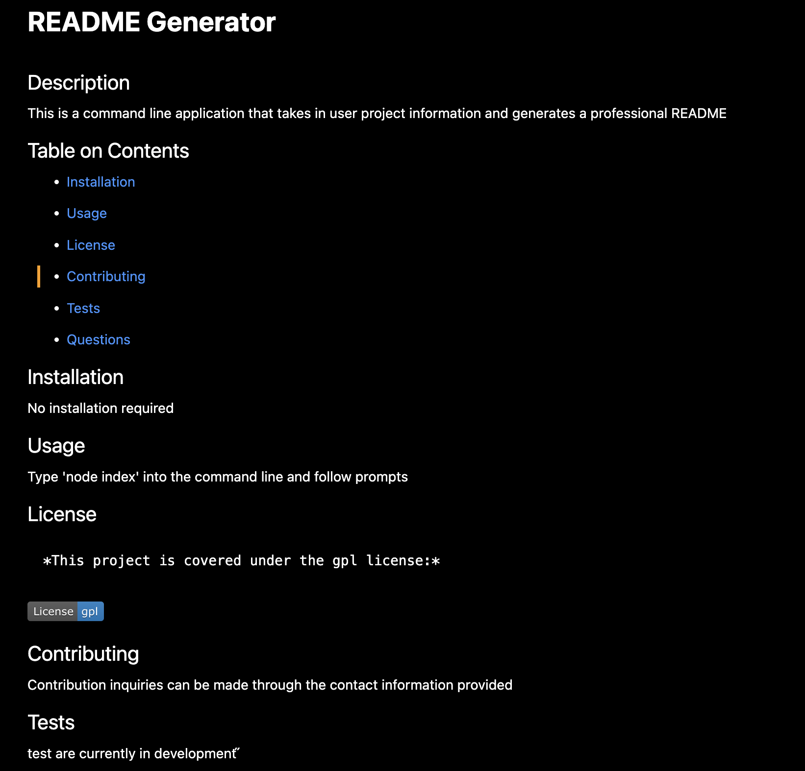

# Professional README Generator

## Description

A command line application that takes in user project information and returns a professional README

## Instructions

Navigate to the application's main directory and type 'node index' into the command line.

## Screencast Link

[Screencast](https://drive.google.com/file/d/1ELvQEX6lXzfZEoOyWtwIwjDA3_VUgFHq/view)

## Repository

[Github](https://github.com/Anthony-A-Perez/readmeGenerator)

## Sample Image

